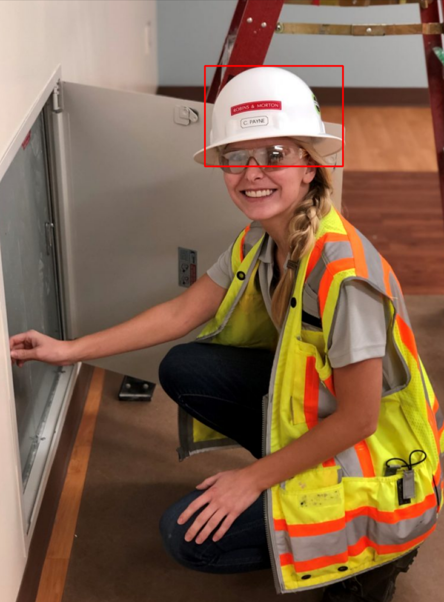

# Hazard Detection

This repository provides all the essential tools and procedures required to prepare and merge the synthetic and [CHV](https://github.com/ZijianWang-ZW/PPE_detection) dataset into a format compatible with the [YOLOv5](https://github.com/ultralytics/yolov5) model for training purposes. 

It serves as a proof of concept, demonstrating the potential of achieving excellent results by combining a small subset of real images with a larger synthetic dataset.

The subsequent steps are aimed at preparing the dataset for training an object detection algorithm, specifically designed to recognize and classify **person**, **vest**, and **helmet** categories.

## Synthetic Dataset Preparation

To effectively train an object detection system using the YOLOv5 model, the dataset should include both the images and corresponding text files that provide annotations for the objects present in these images. For detailed insights into the data structure and annotation format, please refer to the information available at this  [link](https://docs.ultralytics.com/yolov5/tutorials/train_custom_data/).

The synthetic dataset includes labels for various classes as listed below:

```
1: gloves
2: glasses
3: helmet
4: vest
5: person
```
Annotations labeled with **1** correspond to **gloves**, those with label **2** represent **glasses**, and so on for the other categories.

1. To prepare your dataset annotations in the format required by the model, execute the **main.py** script located in the **dataset_formatter** directory by running the following command in your terminal:

```
python dataset_formatter/main.py
```

Upon execution, the script will prompt you to select the directory containing your synthetic images. Navigate to and select the location of your synthetic images to proceed with the formatting process.

2. This guide focuses on training an object detection algorithm to identify **person**, **vest**, and **helmet**.  Therefore, we will remove the classes for gloves and glasses from the  dataset:
```
python utils/delete_lines.py /path/to/synthetic_dataset 1 2
```
3. Last by running the following script all the folders of the images and the labels will be organized in the necessary format:
```
./create_synthetic_dataset.sh
```
Upon executing the script, you will be prompted with the following message:

**"Enter full path of the synthetic dataset:"**

Enter the complete path to the synthetic dataset to initiate the preprocessing process.

After running the bash script, the labels corresponding to each class will be updated as follows:

```
0: person
1: vest
2: helmet
```

All the necessary preprocessing for the synthetic dataset is done!!!

#### 🚧 Important note!!! 🚧

If your intention is to train on different classes, such as including all classes or just two classes like gloves and person, please be aware that this will require adjustments to both the files provided in the "utils" folder and the bash scripts.

## CHV Dataset Preparation

The Color Helmet and Vest (CHV) dataset is a dataset that contains real rgb images tailored for the detection of individuals wearing vests and helmets in four distinct colors.

Here are the labels and their corresponding classes:
```
0: person
1: vest
2: helmet blue color
3: helmet yellow color
4: helmet white color
5: helmet red color  
```

First download the dataset by following this [link](https://drive.google.com/file/d/1fdGn67W0B7ShpBDbbQpUF0ScPQa4DR0a/view)

Once downloaded, execute the provided bash script to prepare the dataset:
```
./create_chv_dataset.sh
```

Following the script's execution, you will need to input both the full path to the CHV dataset and the location where the processed dataset should be saved. In the location to save the dataset you also need to add and the name of the saving folder in the end of the path insertion. For example **"path/to/save/the/dataset/name_of_the_dataset"**


After running the bash script, the labels corresponding to each class will be updated as follows:
```
0: person
1: vest
2: helmet 
```
All the necessary preprocessing for the CHV dataset is done!!!

## 🔴 Optional Step

If you wish, you have the option to test the annotations within the images by executing the following command:

```
python utils/test_annot.py path/to/dataset CHV 2
```

The **test_annot.py** script accepts three distinct arguments:

1. Path of the dataset
2. Type of the dataset (synthetic or CHV)
3. Label to be tested: 0 or 1 or 2

Here are some examples  of the annotations of the helmet class(label number 2) of the CHV dataset:




## Combine CHV and Synthetic Dataset

To combine the datasets run the following bash script:
```
./create_combined_dataset.sh
```

The script will ask the full path of the synthetic dataset and the full path of the CHV dataset.

Upon running the bash script, a new folder named **combined_dataset** will be generated. Inside this folder, you will find:

- A test dataset consisting exclusively of 133 real images from the CHV dataset. This selection ensures testing of the model's real-world applicability.
- In the train folder, there will be a total of 50 images from the CHV dataset and 600 images from the synthetic dataset, facilitating comprehensive training.
- The validation dataset will encompass 25 images exclusively from the CHV dataset, ensuring a diverse and balanced dataset for model evaluation.

If you want to use different number of images of each dataset you must change the values (*NUM_OF_REAL_IMAGES*, *NUM_OF_VALIDATION_IMAGES*, *NUM_OF_SYNTHETIC_IMAGES*) in the **create_combined_dataset.sh** file.


The dataset is complete and ready for training!!!

## Training process

To train the YOLOv5 model, follow these steps:

1. Clone the official repository and install the required packages:
```
git clone https://github.com/ultralytics/yolov5  # clone
cd yolov5
pip install -r requirements.txt  # install
```

2. Navigate to the 'data' folder and create a YAML configuration file:

```
cd data
touch syn_chv.yaml
```

3. Open the yaml and add the following content:

```
path: path/to/dataset # add the full path of the dataset
train: images/train  
val: images/test  
test: images/test

# Classes
names:
  0 : person
  1 : vest
  2 : helmet
```

4. Start training the model by running the following commands:

```
cd ..
python3 train.py --epochs 10 --data syn_chv.yaml --weights yolov5s.pt
```
That's all !! The training process is finished.

## Live Detection

Utilizing the trained model, you can now create a real-time detection to check whether a person is equipped with helmets or vests. This process simply requires a camera to be operational.

To initiate live inference, execute the following commands:

```
cd ..

mv hazard_detection.py path/of/yolov5_repo

cd path/of/yolov5_repo

python hazard_detection.py --weights /path/to/weights/best.pt --source 0 --conf-thres 0.70
```

In the event that the camera fails to recognize the subject, consider altering the **--source** parameter to a different value, such as 1 or 2.

The hazard_detection.py script is designed to identify individuals who are either wearing or not wearing the necessary safety gear. In cases where the appropriate gear is missing, an alert will be displayed in the terminal.
